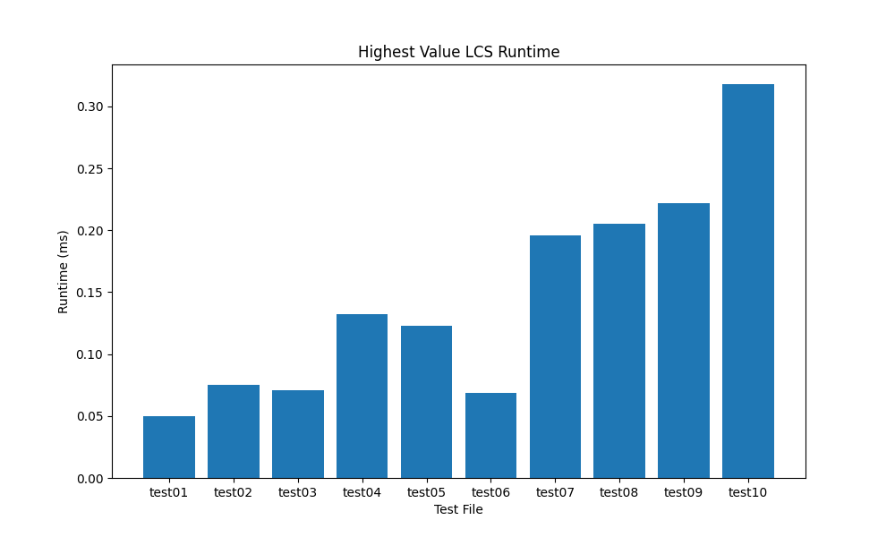

# Highest Value LCS

Ronan Virmani
28617437

## Requirements

- Python 3
- matplotlib (for graphing)

## How to Run

```bash
python3 src/highest_value_lcs.py < data/input/example1.in
```

## Generate Runtime Graph

```bash
pip install matplotlib
python3 src/graph.py
```

## Input Format

```
K
x1 v1
x2 v2
...
xK vK
A
B
```

## Output Format

```
<max_value>
<subsequence>
```
## Questions

# 1. Runtime Analysis



# 2. Recurrence Equation